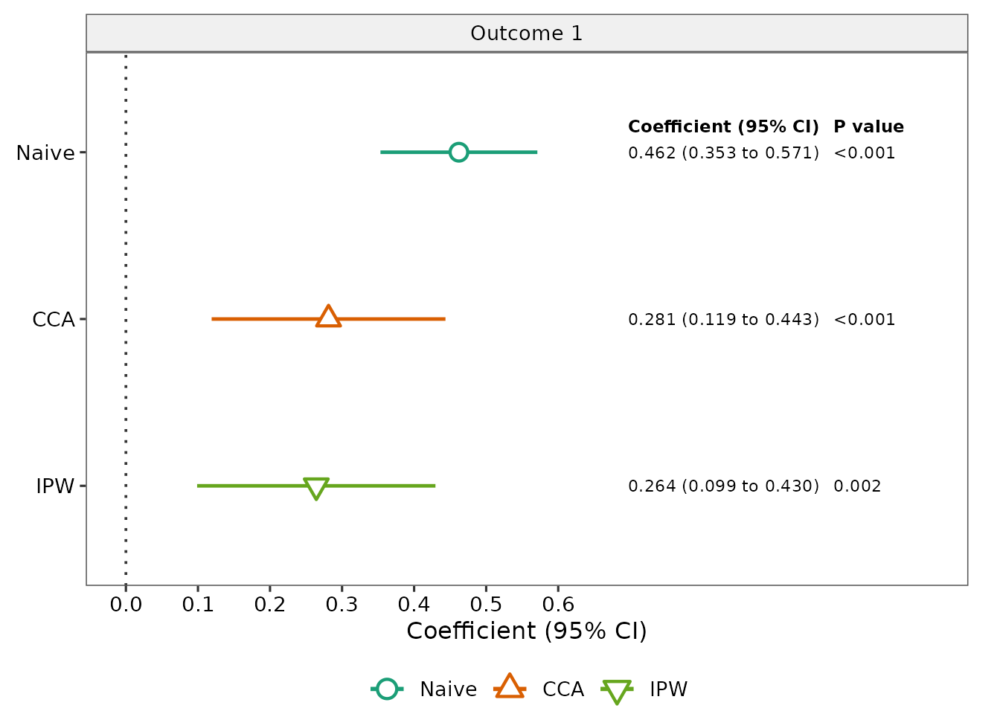
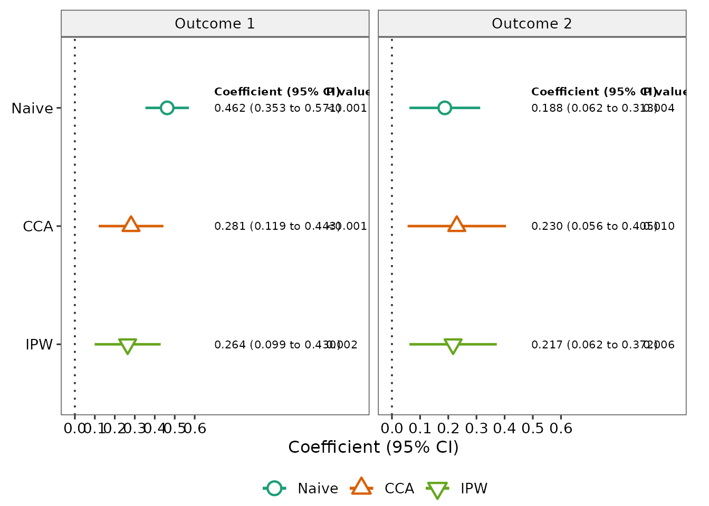
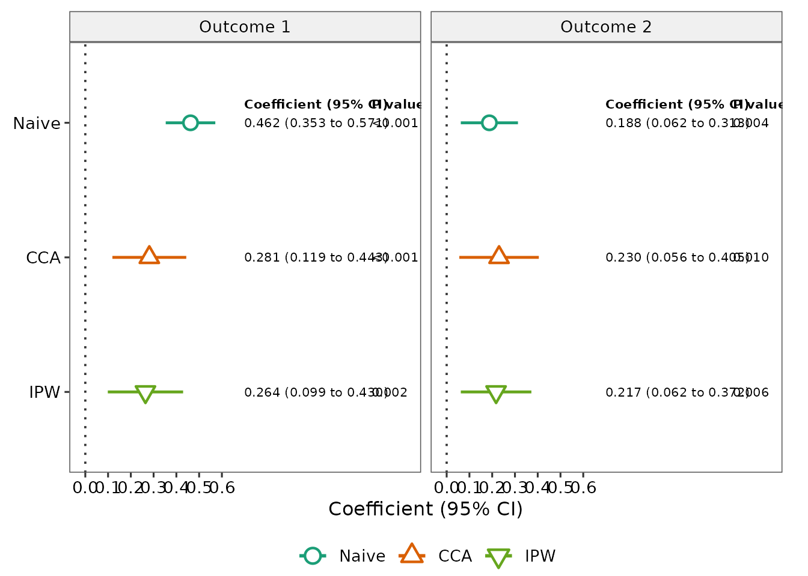

# Getting started with twoPhaseSens

## Overview

`twoPhaseSens` compares analytic approaches for a linear-regression
exposure coefficient when important continuous adjustment covariates are
observed only in a Phase-2 subsample.

Version 0.1.0 focuses on the setting in which:

- the outcome is continuous;
- the primary exposure is numeric;
- ordinary Phase-1 covariates are fully observed;
- continuous Phase-2 covariates are observed together as a block;
- Phase-2 membership is recorded by a 0/1 indicator.

The package implements six approaches:

1.  Naive Phase-1 analysis
2.  Complete-case analysis (CCA)
3.  Fully conditional specification multiple imputation (FCS-MI)
4.  Joint-model multiple imputation (JM-MI)
5.  Inverse probability weighting (IPW)
6.  Augmented inverse probability weighting (AIPW)

The main purpose is **method-comparison sensitivity analysis**. The
package does not automatically decide which method is best for a given
dataset.

## Example data

The package provides a fully synthetic example-data generator. The
generated data are not derived from MIDUS or any other participant-level
study data.

``` r

dat <- twophase_example_data(
  n = 300,
  seed = 2026
)

head(dat)
#>     outcome1    outcome2   exposure         age    sex     marker1    marker2
#> 1  0.9895852  1.38415052 0.51890562  0.52058907   Male  0.84668135  1.3891621
#> 2  1.7813383  0.47466899 1.13539238 -1.07969076 Female  0.32455848 -1.0859213
#> 3 -0.9255271 -0.20621922 0.31240446  0.13923812   Male          NA         NA
#> 4  0.9438086  0.01293047 0.05554413 -0.08474878 Female -0.07300875  0.1480152
#> 5 -0.1282578  1.00813662 1.56545282 -0.66663962 Female  0.38867189  0.1482767
#> 6 -1.1347119  0.94896017 0.71883077 -2.51608903   Male          NA         NA
#>      marker3 phase2
#> 1  0.3881836      1
#> 2  0.5020183      1
#> 3         NA      0
#> 4  1.2164758      1
#> 5 -0.7790284      1
#> 6         NA      0
```

The example contains:

- `outcome1` and `outcome2`: continuous outcomes;
- `exposure`: the primary exposure;
- `age` and `sex`: fully observed Phase-1 covariates;
- `marker1`, `marker2`, and `marker3`: continuous Phase-2 covariates;
- `phase2`: the binary Phase-2 indicator.

Check the Phase-2 structure:

``` r

table(dat$phase2)
#> 
#>   0   1 
#>  99 201

with(
  dat,
  table(
    phase2 = phase2,
    complete_marker_block = complete.cases(marker1, marker2, marker3)
  )
)
#>       complete_marker_block
#> phase2 FALSE TRUE
#>      0    99    0
#>      1     0  201
```

For the supported design, the Phase-2 covariates are observed together
when `phase2 = 1` and missing together when `phase2 = 0`.

## Run a one-outcome analysis

A single outcome is fully supported.

To keep the vignette quick to build, the example below uses only Naive,
CCA, and IPW. In substantive work, users can request all six methods.

``` r

fit_one <- twophase_sensitivity(
  data = dat,
  outcome = "outcome1",
  exposure = "exposure",
  covariates = c("age", "sex"),
  phase2_covariates = c("marker1", "marker2", "marker3"),
  phase2 = "phase2",
  methods = c("naive", "cca", "ipw"),
  seed = 1001
)

fit_one
#> twoPhaseSens analysis
#>   Outcomes: outcome1
#>   Exposure: exposure
#>   Methods: Naive, CCA, IPW
#>   Phase-1 N: 300
#>   Phase-2 N: 201
#> 
#>   outcome method  estimate         se   conf_low conf_high      p_value status
#>  outcome1  Naive 0.4621799 0.05532648 0.35329675 0.5710630 2.591790e-15     ok
#>  outcome1    CCA 0.2812535 0.08226308 0.11900865 0.4434982 7.661356e-04     ok
#>  outcome1    IPW 0.2642349 0.08438535 0.09884266 0.4296272 1.740409e-03     ok
```

The returned object stores the estimates, analysis specification,
settings, and available diagnostics.

``` r

summary(fit_one)
#>    outcome exposure method  estimate         se   conf_low conf_high
#> 1 outcome1 exposure  Naive 0.4621799 0.05532648 0.35329675 0.5710630
#> 2 outcome1 exposure    CCA 0.2812535 0.08226308 0.11900865 0.4434982
#> 3 outcome1 exposure    IPW 0.2642349 0.08438535 0.09884266 0.4296272
#>        p_value  df status message N_phase1 N_phase2 phase2_fraction
#> 1 2.591790e-15 296     ok    <NA>      300      201            0.67
#> 2 7.661356e-04 194     ok    <NA>      300      201            0.67
#> 3 1.740409e-03 Inf     ok    <NA>      300      201            0.67
#>   analysis_seed weight_min weight_p99 weight_max weight_cv weight_ess
#> 1          1001         NA         NA         NA        NA         NA
#> 2          1001         NA         NA         NA        NA         NA
#> 3          1001   1.086953    2.17709   2.289151 0.1612134   195.9331
```

## Create the sensitivity-analysis table

The default output is a publication-ready `gtsummary` table.

``` r

tbl_sensitivity(
  fit_one,
  outcome_labels = c(outcome1 = "Outcome 1"),
  caption = "**Sensitivity analysis for Outcome 1**"
)
```

[TABLE]

**Sensitivity analysis for Outcome 1** {.table .gt_table
quarto-disable-processing="false" quarto-bootstrap="false"}

A plain data frame is also available:

``` r

tbl_sensitivity(
  fit_one,
  outcome_labels = c(outcome1 = "Outcome 1"),
  output = "data.frame"
)
#>   Method Outcome 1 Coefficient (95% CI) Outcome 1 P value
#> 1  Naive      0.4622 (0.3533 to 0.5711)            <0.001
#> 2    CCA      0.2813 (0.1190 to 0.4435)            <0.001
#> 3    IPW      0.2642 (0.0988 to 0.4296)             0.002
```

## Customize displayed precision

Formatting does not change the underlying model estimates.

``` r

tbl_sensitivity(
  fit_one,
  outcome_labels = c(outcome1 = "Outcome 1"),
  estimate_digits = 3,
  p_digits = 4,
  output = "data.frame"
)
#>   Method Outcome 1 Coefficient (95% CI) Outcome 1 P value
#> 1  Naive         0.462 (0.353 to 0.571)           <0.0001
#> 2    CCA         0.281 (0.119 to 0.443)            0.0008
#> 3    IPW         0.264 (0.099 to 0.430)            0.0017
```

Users can also add a separate SE column:

``` r

tbl_sensitivity(
  fit_one,
  outcome_labels = c(outcome1 = "Outcome 1"),
  include_se = TRUE,
  output = "data.frame"
)
#>   Method Outcome 1 Coefficient (95% CI) Outcome 1 SE Outcome 1 P value
#> 1  Naive      0.4622 (0.3533 to 0.5711)       0.0553            <0.001
#> 2    CCA      0.2813 (0.1190 to 0.4435)       0.0823            <0.001
#> 3    IPW      0.2642 (0.0988 to 0.4296)       0.0844             0.002
```

## Run multiple outcomes

Multiple outcomes are analyzed separately using the same exposure,
covariates, Phase-2 variables, and requested methods.

``` r

fit_two <- twophase_sensitivity(
  data = dat,
  outcome = c("outcome1", "outcome2"),
  exposure = "exposure",
  covariates = c("age", "sex"),
  phase2_covariates = c("marker1", "marker2", "marker3"),
  phase2 = "phase2",
  methods = c("naive", "cca", "ipw"),
  seed = 2001
)
```

A scalar seed is expanded sequentially across outcomes. In this example,
the two outcomes use seeds 2001 and 2002.

``` r

unique(fit_two$results[c("outcome", "analysis_seed")])
#>    outcome analysis_seed
#> 1 outcome1          2001
#> 4 outcome2          2002
```

The combined comparison table is:

``` r

tbl_sensitivity(
  fit_two,
  outcome_labels = c(
    outcome1 = "Outcome 1",
    outcome2 = "Outcome 2"
  )
)
```

[TABLE]

## Supply explicit outcome-specific seeds

Users may instead provide one seed per outcome. Named seed vectors can
be supplied in any order.

``` r

fit_seeded <- twophase_sensitivity(
  data = dat,
  outcome = c("outcome1", "outcome2"),
  exposure = "exposure",
  covariates = c("age", "sex"),
  phase2_covariates = c("marker1", "marker2", "marker3"),
  phase2 = "phase2",
  methods = c("naive", "cca"),
  seed = c(
    outcome2 = 9002,
    outcome1 = 9001
  )
)

unique(fit_seeded$results[c("outcome", "analysis_seed")])
#>    outcome analysis_seed
#> 1 outcome1          9001
#> 3 outcome2          9002
```

## Choose which methods to run

All six methods are requested by default, but users may analyze any
subset.

``` r

fit_subset <- twophase_sensitivity(
  data = dat,
  outcome = "outcome1",
  exposure = "exposure",
  covariates = c("age", "sex"),
  phase2_covariates = c("marker1", "marker2", "marker3"),
  phase2 = "phase2",
  methods = c("cca", "fcs_mi", "ipw"),
  n_imputations = 5,
  mice_maxit = 5,
  seed = 3001
)

tbl_sensitivity(
  fit_subset,
  outcome_labels = c(outcome1 = "Outcome 1")
)
```

[TABLE]

The small imputation settings above are used only to keep the vignette
fast. Substantive analyses should choose computational settings
appropriate to the application.

## Control multiple-imputation settings

When FCS-MI or JM-MI is requested, users can control the main
computational settings.

``` r

fit_full <- twophase_sensitivity(
  data = dat,
  outcome = "outcome1",
  exposure = "exposure",
  covariates = c("age", "sex"),
  phase2_covariates = c("marker1", "marker2", "marker3"),
  phase2 = "phase2",
  n_imputations = 50,
  mice_maxit = 20,
  jomo_nburn = 2000,
  jomo_nbetween = 1000,
  seed = 4001
)
```

The arguments mean:

- `n_imputations`: number of completed datasets for FCS-MI and JM-MI;
- `mice_maxit`: maximum FCS iterations;
- `jomo_nburn`: JM-MI burn-in iterations;
- `jomo_nbetween`: iterations between saved JM-MI imputations.

Version 0.1.0 intentionally fixes the FCS imputation method for Phase-2
covariates to normal linear regression because that is the
implementation validated for this release.

## Change the confidence level

The default interval is 95%, but users may request another confidence
level.

``` r

fit_90 <- twophase_sensitivity(
  data = dat,
  outcome = "outcome1",
  exposure = "exposure",
  covariates = c("age", "sex"),
  phase2_covariates = c("marker1", "marker2", "marker3"),
  phase2 = "phase2",
  methods = c("naive", "cca"),
  conf_level = 0.90
)

tbl_sensitivity(
  fit_90,
  outcome_labels = c(outcome1 = "Outcome 1"),
  output = "data.frame"
)
#>   Method Outcome 1 Coefficient (95% CI) Outcome 1 P value
#> 1  Naive      0.4622 (0.3709 to 0.5535)            <0.001
#> 2    CCA      0.2813 (0.1453 to 0.4172)            <0.001
```

## Inspect diagnostics

Method-level status and available diagnostics can be extracted with
[`diagnostics()`](https://rophenceojiambo.github.io/twoPhaseSens/reference/diagnostics.md).

The default view combines general status information with
method-specific diagnostics:

``` r

diagnostics(fit_one)
#>    outcome method status message N_phase1 N_phase2 phase2_fraction
#> 1 outcome1  Naive     ok    <NA>      300      201            0.67
#> 2 outcome1    CCA     ok    <NA>      300      201            0.67
#> 3 outcome1    IPW     ok    <NA>      300      201            0.67
#>   analysis_seed n_imputations mice_maxit jomo_nburn jomo_nbetween
#> 1          1001            NA         NA         NA            NA
#> 2          1001            NA         NA         NA            NA
#> 3          1001            NA         NA         NA            NA
#>   mi_logged_events weight_min weight_p99 weight_max weight_cv weight_ess
#> 1               NA         NA         NA         NA        NA         NA
#> 2               NA         NA         NA         NA        NA         NA
#> 3               NA   1.086953    2.17709   2.289151 0.1612134   195.9331
#>   weight_ess_fraction
#> 1                  NA
#> 2                  NA
#> 3           0.9747914
```

A compact status view is available with:

``` r

diagnostics(fit_one, type = "status")
#>    outcome method status message N_phase1 N_phase2 phase2_fraction
#> 1 outcome1  Naive     ok    <NA>      300      201            0.67
#> 2 outcome1    CCA     ok    <NA>      300      201            0.67
#> 3 outcome1    IPW     ok    <NA>      300      201            0.67
#>   analysis_seed
#> 1          1001
#> 2          1001
#> 3          1001
```

For IPW and AIPW, request weight diagnostics directly:

``` r

diagnostics(fit_one, type = "weights")
#>    outcome method status message N_phase1 N_phase2 phase2_fraction
#> 1 outcome1    IPW     ok    <NA>      300      201            0.67
#>   analysis_seed weight_min weight_p99 weight_max weight_cv weight_ess
#> 1          1001   1.086953    2.17709   2.289151 0.1612134   195.9331
#>   weight_ess_fraction
#> 1           0.9747914
```

These include the minimum weight, 99th percentile, maximum weight,
coefficient of variation, effective sample size, and effective sample
size as a fraction of the Phase-2 sample size.

For FCS-MI and JM-MI, use:

``` r

diagnostics(fit_full, type = "mi")
```

This reports the number of imputations and relevant iteration settings.
For FCS-MI, the number of logged `mice` events is also retained.

Diagnostics can be filtered to particular outcomes or methods:

``` r

diagnostics(
  fit_two,
  outcome = "outcome2",
  method = "ipw"
)
#>    outcome method status message N_phase1 N_phase2 phase2_fraction
#> 1 outcome2    IPW     ok    <NA>      300      201            0.67
#>   analysis_seed n_imputations mice_maxit jomo_nburn jomo_nbetween
#> 1          2002            NA         NA         NA            NA
#>   mi_logged_events weight_min weight_p99 weight_max weight_cv weight_ess
#> 1               NA    1.09867   2.180324   2.518771 0.1606412   195.9681
#>   weight_ess_fraction
#> 1           0.9749656
```

The package reports diagnostic quantities but does not automatically
label them as acceptable or unacceptable. Interpretation should reflect
the study design, sampling mechanism, and substantive context.

## Plot the sensitivity analysis

The fitted object can also be displayed as a publication-style forest
plot of method-specific coefficients and confidence intervals. The
default styling uses the same six-method color palette and open-symbol
scheme as the manuscript figures and adds right-side columns for the
formatted coefficient (95% CI) and p value.

For a single outcome:

``` r

plot_sensitivity(
  fit_one,
  outcome_labels = c(outcome1 = "Outcome 1")
)
```



The base R plotting generic is also supported:

``` r

plot(fit_one)
```

For multiple outcomes, the plot uses separate facets. Free x-axis scales
are used by default because outcomes may have different units.

``` r

plot_sensitivity(
  fit_two,
  outcome_labels = c(
    outcome1 = "Outcome 1",
    outcome2 = "Outcome 2"
  )
)
```



If the outcomes are on a common scale and direct visual comparison is
desired, users can request fixed axes:

``` r

plot_sensitivity(
  fit_two,
  outcome_labels = c(
    outcome1 = "Outcome 1",
    outcome2 = "Outcome 2"
  ),
  facet_scales = "fixed"
)
```



The default reference line is 0. It can be changed or removed with
`reference_line`. The right-side annotation columns can be removed with
`annotate = FALSE`, and their decimal precision can be controlled with
`estimate_digits` and `p_digits`. The estimate-column label can be
changed with `estimate_label`; for example, a manuscript reporting
adjusted regression coefficients can use
`estimate_label = "Adjusted beta"`. An optional overall plot title can
be supplied with `title`.

Because the annotated figure contains a forest region, numeric result
columns, outcome strips, and a legend, a small RStudio Plots pane can
compress the display. This does not change the plotted estimates. For
interactive viewing, use RStudio’s **Zoom** control, enlarge the Plots
pane, or use `annotate = FALSE` for a compact preview.

For manuscript or presentation output, save the plot at an explicit
size. Single-outcome annotated figures generally work well at about 9–10
inches wide, while two-outcome figures benefit from a wider device.

``` r

p_one <- plot_sensitivity(
  fit_one,
  outcome_labels = c(outcome1 = "Primary outcome"),
  estimate_label = "Adjusted beta"
)

ggplot2::ggsave(
  "sensitivity_single_outcome.png",
  p_one,
  width = 9.5,
  height = 6,
  dpi = 320,
  bg = "white"
)

p_two <- plot_sensitivity(
  fit_two,
  outcome_labels = c(
    outcome1 = "Outcome 1",
    outcome2 = "Outcome 2"
  ),
  estimate_label = "Adjusted beta",
  facet_scales = "fixed"
)

ggplot2::ggsave(
  "sensitivity_two_outcomes.png",
  p_two,
  width = 13,
  height = 6,
  dpi = 320,
  bg = "white"
)
```

These dimensions are practical starting points rather than required
settings; users can adjust them for journal, slide, or document
specifications. Because the function returns a `ggplot` object,
additional `ggplot2` layers can also be added by the user.

## Relabel methods and outcomes

Display labels can be customized without changing the stored results.

``` r

tbl_sensitivity(
  fit_one,
  method_labels = c(
    Naive = "Phase-1 naive",
    CCA = "Complete case"
  ),
  outcome_labels = c(
    outcome1 = "Primary outcome"
  ),
  output = "data.frame"
)
#>          Method Primary outcome Coefficient (95% CI) Primary outcome P value
#> 1 Phase-1 naive            0.4622 (0.3533 to 0.5711)                  <0.001
#> 2 Complete case            0.2813 (0.1190 to 0.4435)                  <0.001
#> 3           IPW            0.2642 (0.0988 to 0.4296)                   0.002
```

## What the package currently assumes

The initial release is intentionally constrained to the design that has
been methodologically and numerically validated.

Version 0.1.0 assumes:

- continuous outcomes;
- a linear-regression target model;
- a numeric primary exposure;
- fully observed Phase-1 covariates;
- continuous Phase-2 covariates;
- Phase-2 covariates observed or missing together as a block;
- FCS-MI using normal linear-regression imputation;
- the package’s validated selection-model, marker-model, IPW, and AIPW
  structures.

The initial release does not yet support logistic, count, survival, or
multilevel outcome models; partially observed Phase-2 blocks;
categorical Phase-2 variables requiring different imputation models;
arbitrary nuisance models; or automatic method selection.

## Interpreting the comparison table

The methods rely on different modeling and missing-data assumptions.
Therefore, the table should be used to examine how the estimated
exposure coefficient changes across analytic approaches.

The package does not label one row as the “best” method and does not
interpret statistical significance on the user’s behalf. Method
selection should reflect the study design, scientific assumptions, and
the methodological properties of the estimators.

## Reproducibility

For analyses that involve stochastic imputation:

- save the analysis seed;
- save the imputation and iteration settings;
- report the package version;
- retain the full-precision result object, not only the formatted table.

The table’s decimal controls affect display only. They do not round or
overwrite the underlying estimates stored in the fitted object.
